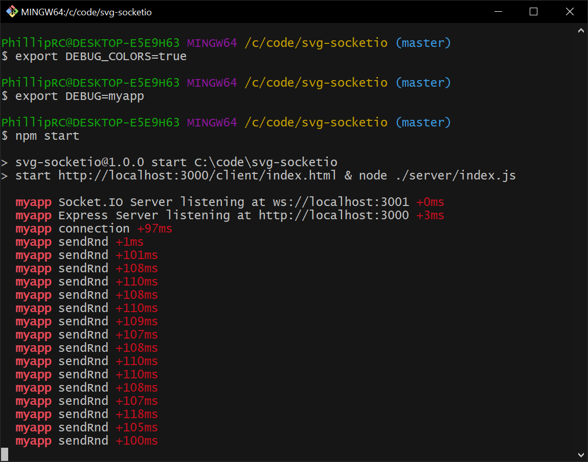

# index.js
- creates a static web server to serve the project files
- creates a Socket.io websocket server
  - accepts connections
  - while a client is connected
    - sends rndData to all connected clients every 100ms
# Output

